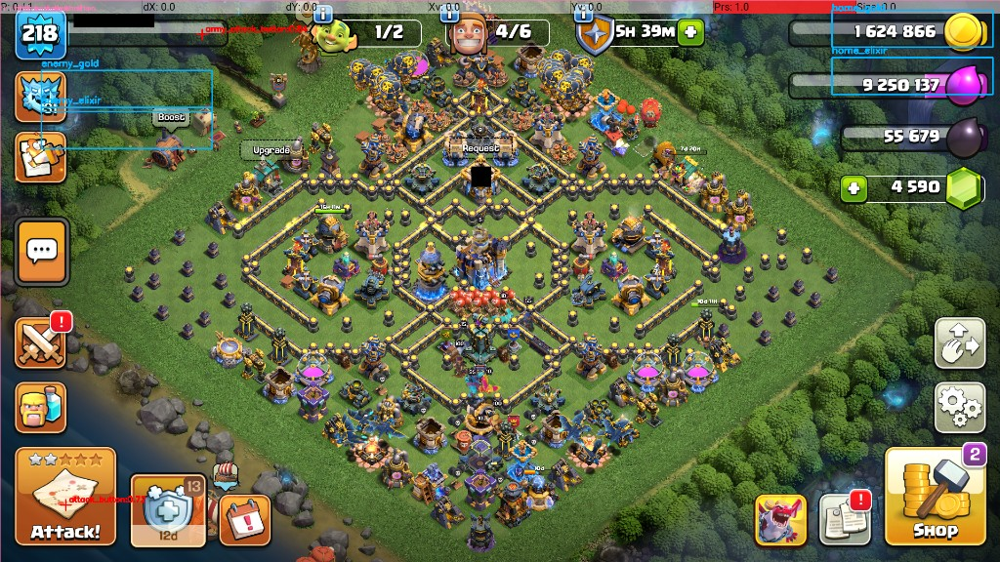

# ClashBotAI (Template Matching + EasyOCR)

ClashBotAI is a Clash of Clans farming bot for Python 3.11 that uses:

- ADB (BlueStacks on `localhost:5555`) for device control
- OpenCV template matching for UI/button detection
- EasyOCR for resource number reading
- A state machine for bot flow orchestration

## Demo Overlay

Example live preview overlay (regions + template/debug annotations):



## Current Runtime Behavior

- Uses template matching for:
  - Home `Attack!`
  - Find Match / Army Attack
  - Next Match
  - Return Home
  - Wall and wall-upgrade buttons
- Uses OCR for home/enemy gold and elixir values
- Wall upgrade checks are only evaluated after a completed battle cycle
- Wall upgrade threshold uses OR logic:
  - `home_gold >= 10,000,000` **OR** `home_elixir >= 10,000,000`

---

## Requirements

- macOS (or similar) with Python 3.11
- BlueStacks running Clash of Clans
- ADB available in PATH

Install Python dependencies:

```bash
python3 -m pip install --user -r requirements.txt
```

Install ADB (if needed):

```bash
brew install android-platform-tools
```

---

## Quick Start

From project root:

```bash
cd /Users/hansonliu/clashbotAI
adb connect localhost:5555
adb devices
```

### Dry run (no taps/swipes sent)

```bash
python3 main.py --dry-run --preview --preview-scale 0.8 --debug-dir debug --debug-every 2
```

### Live run (real taps/swipes)

```bash
python3 main.py --preview --preview-scale 0.8 --debug-dir debug --debug-every 2
```

Stop bot:

- Press `q` or `Esc` in preview window, or
- Press `Ctrl+C` in terminal

---

## Project Files

- `main.py` - main loop, preview/debug output, execution
- `state_machine.py` - bot decision logic and state transitions
- `adb_controller.py` - all ADB actions (tap/swipe/screenshot/readiness)
- `template_matcher.py` - OpenCV template matching engine
- `ocr.py` - EasyOCR reading + OCR stabilization
- `config.yaml` - thresholds, regions, template paths, coordinates
- `templates/` - image templates used by matcher
- `debug/` - saved overlay snapshots + `events.jsonl`

---

## Config Notes

Primary knobs in `config.yaml`:

- `thresholds.upgrade_min_resource`
- `thresholds.match_min_gold`
- `thresholds.match_min_elixir`
- `thresholds.require_both_for_wall_upgrade`
- `templates.thresholds.*` (per-template confidence tuning)
- `templates.regions.*` (search areas)
- `regions.*` (OCR crop regions)
- `coordinates.*` (fallback tap points)

---

## Troubleshooting

### `adb: command not found`

Install ADB and restart shell:

```bash
brew install android-platform-tools
exec zsh
```

### Bot taps unexpectedly after reconnect

Kill any lingering bot process:

```bash
pkill -f "/Users/hansonliu/clashbotAI/main.py"
adb disconnect
adb connect localhost:5555
```

### OCR wrong / unstable

- Tune `regions.home_*` and `regions.enemy_*` in `config.yaml`
- Check overlay output with `--preview`
- Inspect `debug/events.jsonl` for OCR values and actions

### Template not detected

- Replace template image in `templates/`
- Tune `templates.thresholds.<key>`
- Narrow or widen `templates.regions.<key>`

---

## Safety

Start with dry-run before live mode after any template/config change.
